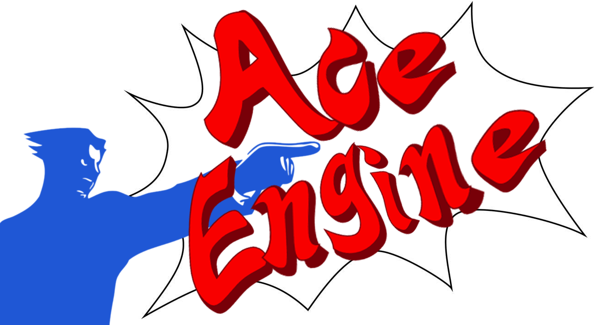

# Ace Engine


## Contribute

no(t yet) or check the donate link down below! (do it, im starving!!)

## About

Ace Engine is (planning on being) a text based Ace Attorney scene editor.  
The **main goal** is to be able to have a single character of your choosing have max 3 lines text of stuff to say, 
together with the ability of throwing around different animations, delays, screen flashes, screen shakes and other effects
such as objection or other character specific text bubbles. 

## Usage (unusable at the moment)

This is unusable at the moment but this function will be how you will use AceEngine in **code**.  

```C#
public MagickCollection GenerateImage(string input);
```

The `input` variable is the "code" that the user will type to generate an image.  
I am so very sorry, but I'm going to be making my own syntax for this. I don't know yet how the syntax will end up as, but I've got a protoype ready. 

Here's an example of I want it to be: 

```
@[c:phoenix e:proud] This glove is made for a @(t:red)left-handed @(t:normal) person!
```

Easy, right? `@[]` will mean a new piece of dialogue.  
And `@()` will be an action that adjusts the text. 

This will include actions such as  
```
e: set emote (animation)
t: set text color
d: set delay text
s: set text speed
B: show text bubble 
```

And (maybe) more. Or even less.

## Depdencies

Ace Attorney depends on [MagickSharp](https://github.com/stepperman/MagickSharp) 
which is a cross-platform [Magick.Net](https://github.com/dlemstra/Magick.NET) remake I made to learn C and to allow .NET and ImageMagick on other platforms. Magick.Net is capable of this now as well, although using it on Linux or macOS requires exta work.  
Or just call MagickSharp a ImageMagick/MagickWand wrapper. Which it is. 

~~I feel like using an image suite for a simple task of generating a frame and saving it is stupid. So I will probably switch this over to a faster and other graphics library.  
Something like OpenGL (help) or a wrapper of it. I think this would make it much quicker to export.~~

I am currently working on making a C library for making frames and saving them as a gif instead of using ImageMagick.  
There is probably a .NET graphics library I could use but I want to see how fast it can get if I make a "native" library, since I want the gifs to be as small as possible, and be generated _really_ quickly. I'll make a speed comparison if I get version 1.0 finished to see how much the speed difference is between a .NET graphics library and a native custom written SDL library.

## Planned features

Oh hi! You're actually reading this? Well OK. There's a couple features I have planned that I will consider version 1.0 and will work how I desire it.  
But I'll also expand on this project some more, like including a complete scene editor, and make the possibility to add investagion scene dialogue, as well.  

### Version 1.0 
Striped through is added.

 * Use SDL for image processing instead of ImageMagick
 * Text engine
 * ~~Exporting dialogue as gif~~
 * Actions in the text engine
 * Adding custom characters/items (with the use of the people.ace)
 
### other features

 * Evidence items. (Maybe allow custom ones by downloading them?)
 * Investigation scenes
 * Scene editor (meaning that multiple characters can talk in one gif)
 * GUI/web interface with nodes and stuff. Haha.
 
## Documentation

Yes! No! Wait.  
A documentation will come later. Which will mostly be on the acescript, the script for letting them talk in a gif. (trademarked btw. not really)

## Donate

What the frick? I ordered an Xbox card, not money.  
I tricked you. No donations.
